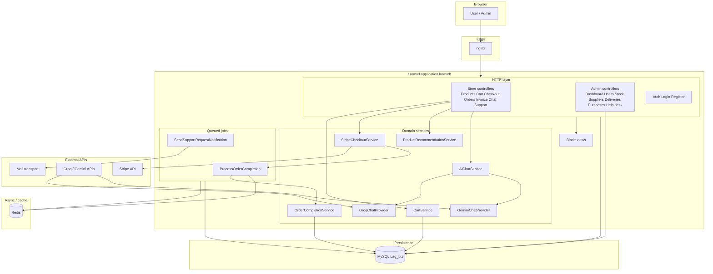
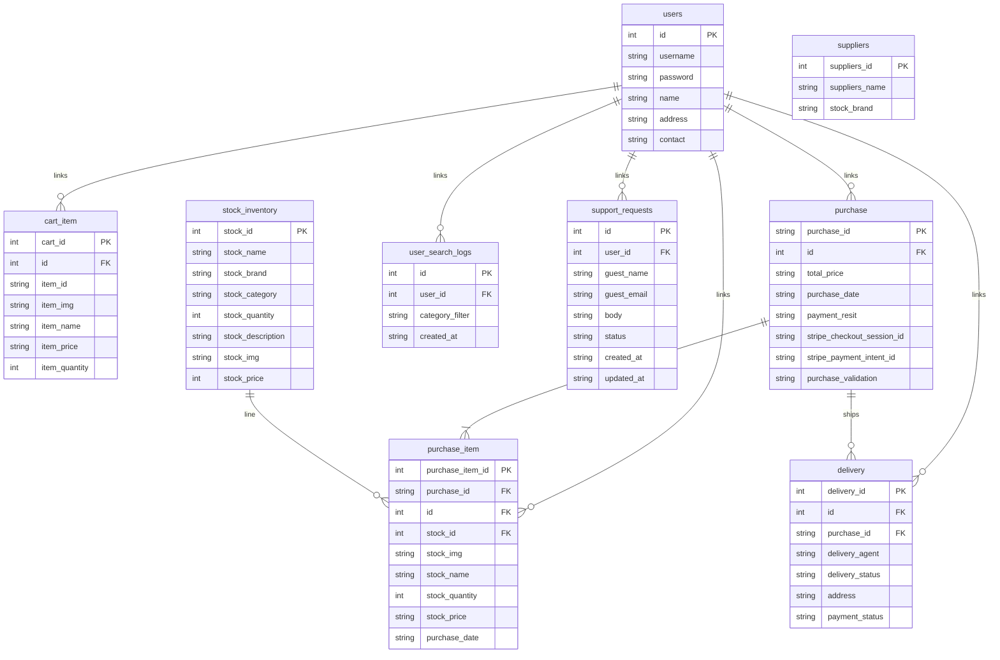
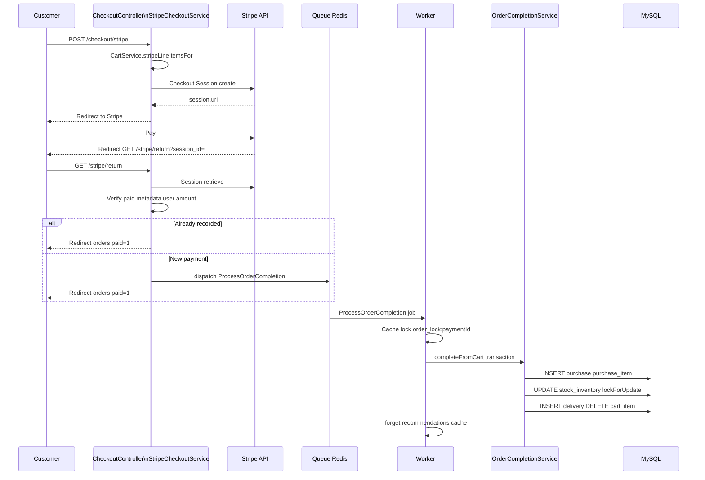
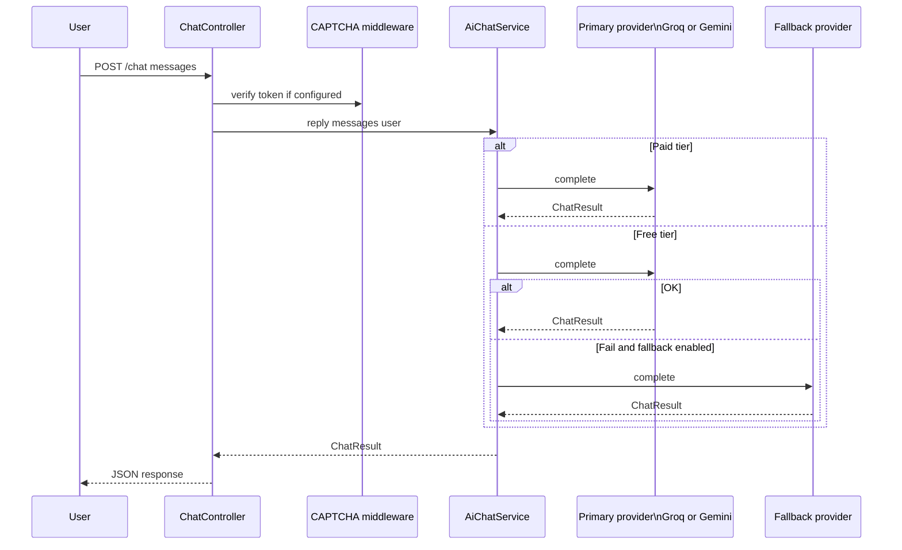
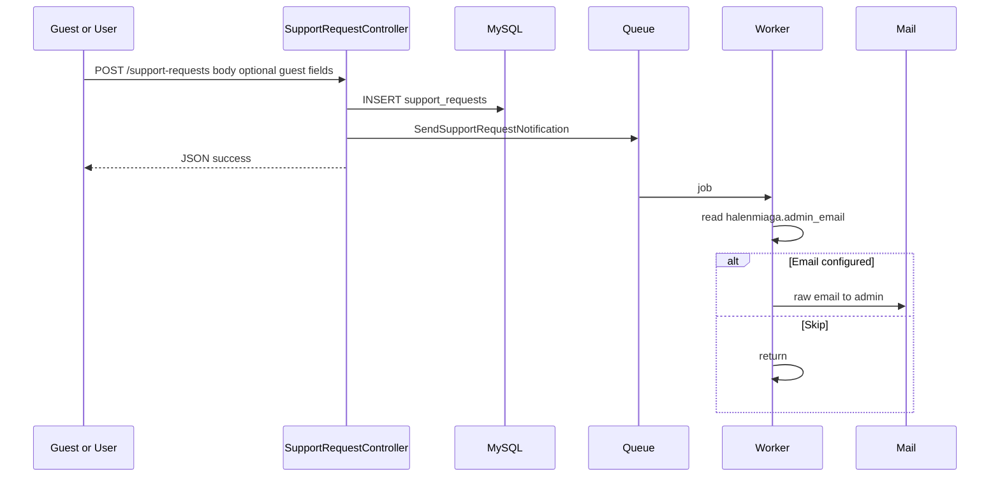
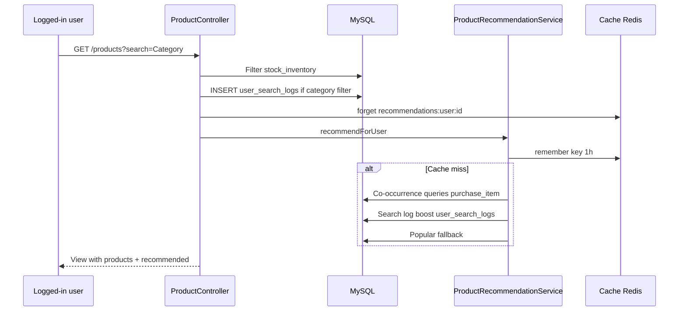

# HalenMiaga (Bag E‑commerce) — Project Documentation

This document describes **architecture**, **modules**, **database structure**, **sequence flows**, and **operational context** for the Bag E‑commerce application (**HalenMiaga**). The runnable Laravel app lives under `laravel/`; the MySQL schema for core business tables is applied with **Phinx** from the repository root (`database/migrations/`). Laravel migrations add framework and app-specific tables on top of the same database.

---

## 1. Executive summary

| Aspect | Description |
|--------|-------------|
| **Purpose** | Online bag shop: catalog, cart, **Stripe Checkout**, orders/invoices, **personalized recommendations**, **AI chat**, **help desk tickets**, and an **admin** back office. |
| **Stack** | PHP 8.2+, Laravel 11, MySQL 8, Redis (queues + cache locks), nginx + php-fpm (Docker). |
| **Schema split** | **Phinx**: legacy-aligned tables (`users`, `stock_inventory`, `cart_item`, `purchase`, `purchase_item`, `delivery`, `suppliers`) + FKs + Stripe columns on `purchase`. **Artisan**: `user_search_logs`, `support_requests`, Laravel `jobs` / `cache` / `failed_jobs`. |
| **Integrations** | Stripe (Checkout Sessions), optional Groq + Gemini (AI chat), SMTP (support ticket notifications to admin). |

---

## 2. High-level system architecture

The following diagram shows **major modules** and how they connect to infrastructure and external systems.

**Runtime notes**

- **HTTP**: Single entry `laravel/public` (see `docker/nginx/default.conf`).
- **Workers**: `docker-compose` defines a **`worker`** service running `php artisan queue:work redis` so `ProcessOrderCompletion` and `SendSupportRequestNotification` execute asynchronously.
- **RabbitMQ** is present in Compose for future use; the queue connection used by the workers is **Redis** unless you change `QUEUE_CONNECTION` in `.env`.

---

## 3. Application modules (by concern)

### 3.1 Storefront (customer)

| Area | Routes (examples) | Responsibility |
|------|-------------------|----------------|
| **Home** | `GET /` | Landing. |
| **Catalog** | `GET /products`, `GET /products/{stock}` | List/detail; category filter; logs `user_search_logs` for logged-in users; shows recommendations. |
| **Cart** | `POST /cart/add/{stock}`, `GET /cart`, `POST /cart/remove/{item}` | Session-backed cart rows in `cart_item` (keyed by user `id`). |
| **Checkout** | `POST /checkout/stripe`, `GET /stripe/return` | Creates Stripe Checkout Session; on return verifies payment and dispatches order completion job. |
| **Orders & invoices** | `GET /orders`, `GET /invoice/{purchase}`, `GET /download/receipt` | Order history, invoice view, receipt download (policy-gated). |
| **AI chat** | `POST /chat` | Authenticated chat; rate limits + CAPTCHA middleware; `AiChatService` + providers. |
| **Help desk** | `POST /support-requests` | Creates `support_requests` (guest or user); queues admin email. |

**Middleware highlights** (see `routes/web.php`, `bootstrap/app.php`): `auth`, `throttle:*`, `captcha` (chat/support), `recaptcha.form` + `honeypot` (login/register), `admin` for `/admin/*`.

### 3.2 Administration

| Area | Routes | Responsibility |
|------|--------|----------------|
| **Dashboard** | `GET /admin` | Overview / metrics. |
| **Users** | CRUD except show | Customer accounts (non-admin flows). |
| **Stock** | Full resource | Product catalog (`stock_inventory`). |
| **Suppliers** | Full resource | `suppliers`. |
| **Deliveries** | index, edit, update | `delivery` records. |
| **Purchases** | index, edit, update, destroy | `purchase` / validation workflow. |
| **Purchase items** | edit, update, destroy | Line items. |
| **Help desk** | index, show, update | Support tickets (`support_requests`). |

Admin access: user must be authenticated and `users.username` must match `BAG_ADMIN_USER` (`EnsureUserIsAdmin`).

### 3.3 Authentication

- Registration and login with throttling, honeypot, and optional reCAPTCHA on forms.
- Custom **SHA-256 fallback** provider: legacy salted SHA-256 passwords are verified and rehashed to bcrypt on success (`AppServiceProvider`, `Sha256FallbackUserProvider`).

### 3.4 Domain services (selected)

| Service | Role |
|---------|------|
| `CartService` | Add/remove lines with row locks on `stock_inventory`; builds Stripe line items (MYR cents). |
| `StripeCheckoutService` | Creates Checkout Session; `handleReturn` verifies session, idempotency, amount match; dispatches `ProcessOrderCompletion`. |
| `OrderCompletionService` | Transaction: insert `purchase` / `purchase_item`, decrement stock, create `delivery`, clear `cart_item`. |
| `ProductRecommendationService` | Co-occurrence scores from `purchase_item`, boost from `user_search_logs`, popularity fallback; cached per user. |
| `AiChatService` | System prompt + user context; paid tier = Gemini only; free tier = configurable primary + fallback. |

---

## 4. Database structure

### 4.1 Schema ownership

1. **Phinx** (`vendor/bin/phinx migrate` from repo root): core e‑commerce tables and foreign keys.
2. **Artisan** (`cd laravel && php artisan migrate`): Laravel tables + `user_search_logs`, `support_requests`.

### 4.2 Entity relationship (conceptual)

**GitHub / Mermaid note:** Entity fields are drawn in a simplified form. GitHub’s `erDiagram` parser does not accept extra words on one line (for example `FK users`, or `nullable` after a column name), so foreign keys are shown as a bare `FK` and optional columns are drawn like normal columns. Exact SQL types, nullability, and FK targets are listed in **section 4.3** below.

**Note:** `suppliers` exists for admin/supplier management; there is **no FK** from `stock_inventory` to `suppliers` in the migrated schema (brand is denormalized on stock rows).

### 4.3 Table reference (columns)

#### Phinx — `users`

| Column | Type | Notes |
|--------|------|-------|
| `id` | int, PK | |
| `username`, `password`, `name`, `address`, `contact` | varchar | Password: bcrypt or legacy `s256$…` |

#### Phinx — `stock_inventory`

| Column | Type | Notes |
|--------|------|-------|
| `stock_id` | int, PK | |
| `stock_name`, `stock_brand`, `stock_category` | varchar | |
| `stock_quantity` | int | Decremented on successful checkout completion. |
| `stock_description` | varchar(10000) | |
| `stock_img`, `stock_price` | varchar / int | Price stored as integer in DB; cart/Stripe convert as needed. |

#### Phinx — `cart_item`

| Column | Type | Notes |
|--------|------|-------|
| `cart_id` | int, PK | |
| `id` | int, FK → `users.id` | **Legacy naming:** user id. |
| `item_id` | varchar | String form of `stock_id`. |
| `item_img`, `item_name`, `item_price`, `item_quantity` | | Snapshot for checkout. |

#### Phinx — `purchase`

| Column | Type | Notes |
|--------|------|-------|
| `purchase_id` | varchar(100), PK | Business id (e.g. `RST-…` from Stripe flow). |
| `id` | int, FK → `users.id` | |
| `total_price` | varchar | |
| `purchase_date` | date | |
| `payment_resit` | varchar(200), nullable | Legacy receipt path; Stripe flow may leave empty. |
| `stripe_checkout_session_id`, `stripe_payment_intent_id` | varchar, nullable | Added by Phinx migration. |
| `purchase_validation` | varchar | e.g. `Approved`. |

#### Phinx — `purchase_item`, `delivery`

Line items mirror cart snapshots; `delivery` ties a user and `purchase_id` to shipping/payment status fields.

#### Laravel — `user_search_logs`

| Column | Type | Notes |
|--------|------|-------|
| `user_id` | unsigned int, FK | Cascade delete. |
| `category_filter` | string, nullable | Category filter from product list. |
| `created_at` | timestamp | |

#### Laravel — `support_requests`

| Column | Type | Notes |
|--------|------|-------|
| `user_id` | nullable FK | Null for guests; `guest_name` / `guest_email` then required at validation layer. |
| `body`, `status` | text / string | Default status `open`. |

#### Laravel — framework tables

- **`jobs`**, **`job_batches`**, **`failed_jobs`**: queue metadata.
- **`cache`**, **`cache_locks`**: database cache + locks if configured (order completion also uses `Cache::lock` with the default cache store; in Docker, **Redis** is typical for queue + cache).

---

## 5. Sequence diagrams

### 5.1 Stripe Checkout and order completion

Successful payment creates a **queued** job so the web request stays fast; idempotency uses `stripe_checkout_session_id` and cache locks on `payment_id`.

### 5.2 AI storefront chat

### 5.3 Support request and admin notification

### 5.4 Product listing, search logging, and recommendations

---

## 6. Configuration reference (short)

| Concern | Where |
|---------|--------|
| App URL, DB | `laravel/.env`, Docker `LARAVEL_APP_URL`, `BAG_DB_*` / `DB_*` |
| Admin username | `BAG_ADMIN_USER` must match `users.username` |
| Stripe | `STRIPE_SECRET_KEY`, `STRIPE_PUBLISHABLE_KEY` (frontend if used) |
| AI chat | `laravel/config/ai_chat.php`, env: `GEMINI_API_KEY`, `GROQ_API_KEY`, `AI_CHAT_TIER`, `AI_CHAT_PRIMARY_WHEN_FREE`, `AI_CHAT_FALLBACK_ENABLED` |
| CAPTCHA | `AI_CAPTCHA_DRIVER`, Turnstile or reCAPTCHA keys |
| Recommendations limit | `BAG_RECOMMENDATION_LIMIT` / `config/halenmiaga.php` |
| Admin email for tickets | `halenmiaga.admin_email` (see `config/halenmiaga.php`) |

---

## 7. Security and compliance notes

- **Checkout**: Session metadata must match authenticated user; amount cross-check against Stripe `amount_total`; duplicate session id short-circuit.
- **Order completion**: Database transaction + row locks on stock; cache lock on `payment_id` to prevent double processing.
- **Admin**: Username gate + authenticated session.
- **Uploads / receipts**: Random filenames; type restrictions (see app config and controllers).
- **Passwords**: Prefer bcrypt for new passwords; legacy SHA-256 supported with upgrade path.

---

## 8. Related files

| Topic | Location |
|-------|----------|
| Routes | `laravel/routes/web.php` |
| Phinx schema | `database/migrations/*.php` |
| Laravel migrations | `laravel/database/migrations/*.php` |
| Docker | `docker-compose.yml`, `Dockerfile`, `docker/nginx/default.conf` |
| Quick start | `README.md` |

---

*Generated for the Bag E‑commerce / HalenMiaga codebase. Diagrams use [Mermaid](https://mermaid.js.org/); render in GitHub, GitLab, VS Code, or any Mermaid-compatible viewer.*
